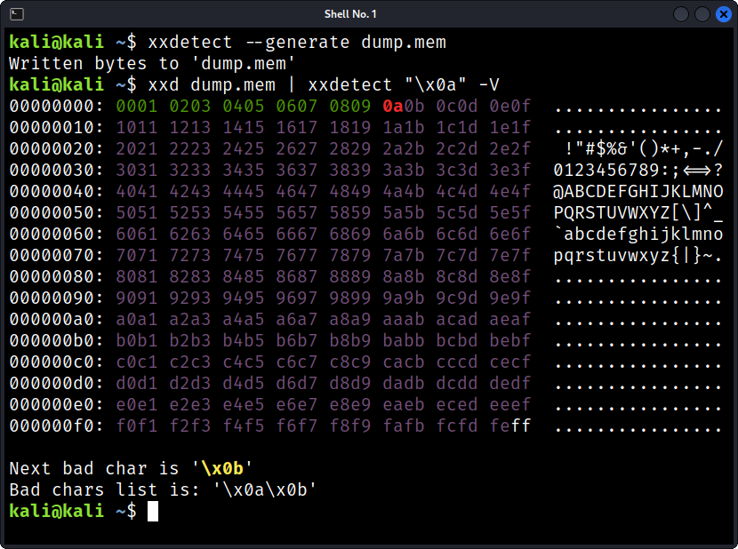

# xxdetect
Utility to help identify bad characters.



# Usage
1. Inject Bad chars
1. Get memory dump
1. Use xxdetect to identify bad character

### Example
```bash
# Dump
$ xxdetect --generate dump.mem
#=> Written bytes to 'dump.mem'

$ xxd dump.mem | xxdetect "\x0a"
```

### Options

| Option  | Description |
| ------------- | ------------- |
| -g, --generate FILE  | Creates a binary file containing all bad chars  |
| -o, --only   | Only prints next bar char  |
| -V, --verbose   | Add verbose output   |

# Installation
```bash
git clone https://github.com/DDAZZA/xxdetect.git
cd xxdetect/
sudo ln -s xxdetect.rb /usr/local/bin/xxdetect
```

# TODO
- [ ] Add error handling
